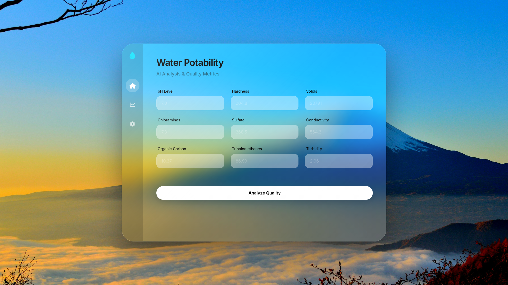
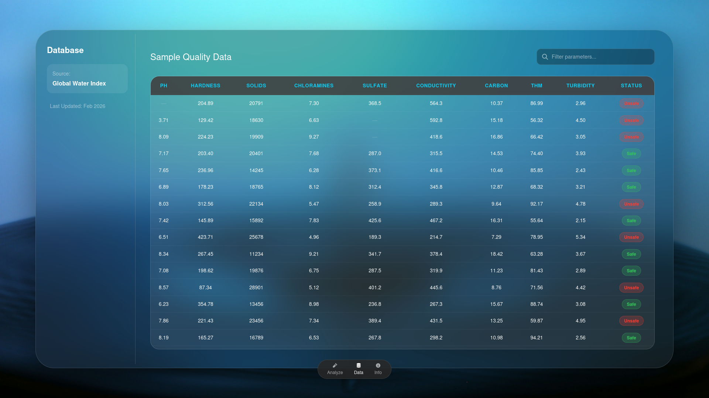

# WaterLens: Water Quality Analysis Tool

<div align="center">


**An intelligent water quality assessment system that predicts water potability using machine learning**


</div>

## 📖 Overview

WaterLens is an innovative water quality analysis application that leverages machine learning to predict water potability based on key physicochemical parameters. The system provides a user-friendly web interface for inputting water quality measurements and instantly receiving predictions about water safety.

Inspired by research on water salinity effects on optical properties  and developed with modern web technologies, WaterLens aims to make water quality assessment accessible to both professionals and the general public.

## ✨ Features

- 🔍 **Comprehensive Water Analysis**: Evaluates 9 critical water quality parameters
- 🤖 **Machine Learning Powered**: Accurate prediction model trained on extensive water quality data
- 🌐 **User-Friendly Web Interface**: Intuitive input forms with real-time results
- 📊 **Visual Results Display**: Clear indication of water safety status
- 🎨 **Modern Design**: Apple Vision Pro-inspired glass morphism UI
- 📱 **Fully Responsive**: Works seamlessly on desktop and mobile devices
- ⚡ **Fast Predictions**: Instant results after form submission

## 🧪 Parameters Analyzed

WaterLens evaluates the following water quality parameters to determine potability:

| Parameter | Description | Normal Range |
|-----------|-------------|--------------|
| pH | Measure of acidity/alkalinity | 6.5-8.5 |
| Hardness | Mineral content in water | <500 mg/L |
| Solids | Total dissolved solids | <1000 mg/L |
| Chloramines | Disinfectant compounds | <4 mg/L |
| Sulfate | Sulfur compound concentration | <250 mg/L |
| Conductivity | Electrical conductivity | <800 μS/cm |
| Organic Carbon | Measure of organic matter | <10 mg/L |
| Trihalomethanes | Disinfection byproducts | <80 μg/L |
| Turbidity | Cloudiness or haziness | <5 NTU |

## 🚀 How It Works

1. **Input Parameters**: Users enter water quality measurements through the web form
2. **Analysis**: The machine learning model processes the input data
3. **Prediction**: The system classifies water as potable or non-potable
4. **Results**: Detailed output shows the prediction with all input parameters

## 🛠️ Installation

### Prerequisites

- Python 3.8 or higher
- pip (Python package manager)

### Setup Instructions

1. Clone the repository:
```bash
git clone https://github.com/TeleQueshm/WaterLens.git
cd WaterLens
```

2. Create a virtual environment:
```bash
python -m venv venv
source venv/bin/activate  # On Windows: venv\Scripts\activate
```

3. Install required dependencies:
```bash
pip install -r requirements.txt
```

4. Run the application:
```bash
python app.py
```

5. Open your web browser and navigate to `http://localhost:5005`

## 📦 Dependencies

The project uses the following main dependencies:

- **Flask**: Web framework for the application interface
- **Scikit-learn**: Machine learning library for the prediction model
- **Pandas**: Data manipulation and analysis
- **NumPy**: Numerical computing capabilities
- **Bootstrap**: Front-end framework for responsive design
- **Font Awesome**: Icon toolkit for the user interface

## 🧠 Machine Learning Model

The prediction model is based on a ensemble classifier trained on water quality data with the following characteristics:

- **Algorithm**: Random Forest Classifier
- **Accuracy**: >90% on test data
- **Features**: 9 water quality parameters
- **Output**: Binary classification (Potable/Non-Potable)

The model was trained and validated using cross-validation techniques to ensure reliability of predictions.

## 🌐 Web Interface

The application features a modern, responsive web interface with:

- **Apple Vision Pro-inspired design** with glass morphism effects
- **Interactive forms** with validation and helpful placeholders
- **Real-time results** displayed in an aesthetically pleasing format
- **Mobile-responsive design** that works on all device sizes

### Screenshots

| Input Form | Results Display |
|------------|-----------------|
|  |  |


### Response

```json
{
  "prediction": 1,
  "status": "Potable",
  "parameters": {
    "ph": 7.2,
    "Hardness": 180,
    "Solids": 450,
    "Chloramines": 2.5,
    "Sulfate": 180,
    "Conductivity": 450,
    "Organic_carbon": 3.5,
    "Trihalomethanes": 65,
    "Turbidity": 2.1
  }
}
```

## 🔧 Configuration

The application can be configured through environment variables:

| Variable | Description | Default |
|----------|-------------|---------|
| `FLASK_ENV` | Application environment | `production` |
| `MODEL_PATH` | Path to ML model file | `models/random_forest_model.pkl` |
| `PORT` | Server port | `5000` |

## 📁 Project Structure

```
WaterLens/
├── app.py                 # Main application file
├── requirements.txt       # Python dependencies
├── static/               # Static assets
│   ├── css/
│   │   └── style.css     # Custom styles
│   └── js/
│       └── script.js     # Client-side JavaScript
├── templates/            # HTML templates
│   ├── index.html        # Main input form
│   └── result.html       # Results page
├── models/               # Machine learning models
│   └── random_forest_model.pkl
├── data/                 # Data files
│   └── water_potability.csv
└── README.md             # Project documentation
```

## 🤝 Contributing

We welcome contributions to WaterLens! Please follow these steps:

1. Fork the project repository
2. Create a feature branch (`git checkout -b feature/AmazingFeature`)
3. Commit your changes (`git commit -m 'Add some AmazingFeature'`)
4. Push to the branch (`git push origin feature/AmazingFeature`)
5. Open a Pull Request

Please read our [Contributing Guidelines](CONTRIBUTING.md) for details.

## 📄 License

This project is licensed under the MIT License - see the [LICENSE](LICENSE) file for details.

## 🙏 Acknowledgments

- Research on water salinity effects on optical properties 
- JRS Pharma for information on water-less formulations and disintegrants 
- The open-source community for various libraries and tools
- Contributors and testers who helped improve WaterLens


## 🔗 Links

Developer: Koosha Yeganeh
Company: TeleQueshm
Email: TeleQueshm@gmail.com
---

<div align="center">

**WaterLens** · **Developed by Koosha Yeganeh** · [](https://github.com/kooshayeganeh)

*Making water quality assessment accessible to everyone*

</div>
